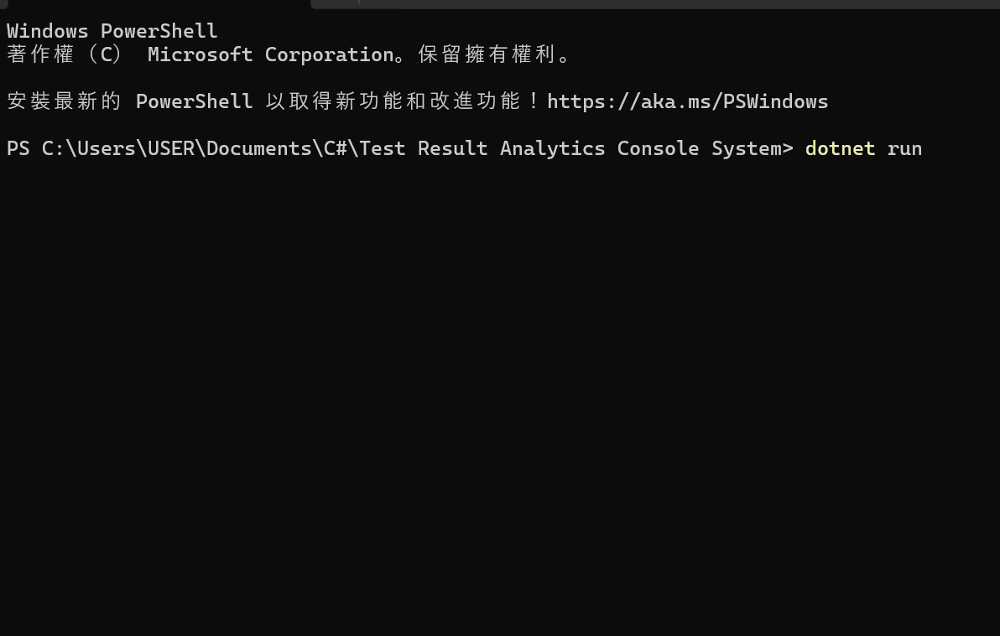

# 🛠️ SmartDevice-Insight

**Lightweight Device Test Data Analytics System (C# / MSSQL)**

---

## 📌 Overview

SmartDevice-Insight is a lightweight console-based system designed to record, manage, and analyze device testing data in engineering environments.

It simulates real-world workflows in semiconductor and storage testing scenarios, enabling engineers to efficiently log metrics such as IOPS, temperature, and yield while maintaining structured database integration.

This project demonstrates backend development fundamentals using C#, ADO.NET, and Microsoft SQL Server, with a focus on data validation, structured storage, and analytical querying.

---

## 🎯 Key Features
- Store and manage device test data (C# + MSSQL)
- Insert and view records via console interface
- Input validation to ensure correct numeric data
- Simple menu-driven interaction

---

## 🧠 Use Case

This project simulates basic engineering scenarios such as:

- Semiconductor testing workflows  
- SSD / storage performance benchmarking  
- General engineering data logging  

---

## 🛠️ Tech Stack

| Category    | Technology                                  |
|------------|----------------------------------------------|
| Language   | C# (.NET)                                    |
| Database   | Microsoft SQL Server (MSSQL)                 |
| Data Access| ADO.NET (SqlConnection, SqlCommand)          |
| Concepts   | CRUD Operations, Data Validation             |
| Tools      | Visual Studio, SQL Server Management Studio  |

---

## 🗄️ Database Schema

### Device

| Column | Type     |
| ------ | -------- |
| Id     | INT (PK) |
| Name   | NVARCHAR |
| Type   | NVARCHAR |

### TestResult

| Column   | Type     |
| -------- | -------- |
| Id       | INT (PK) |
| DeviceId | INT (FK) |
| TestType | NVARCHAR |
| Value    | FLOAT    |
| Unit     | NVARCHAR |
| TestDate | DATETIME |

---

## 🚀 Getting Started

### 1️⃣ Prerequisites

* .NET SDK
* Microsoft SQL Server
* SQL Server Management Studio (SSMS)

---

### 2️⃣ Setup Database

Run the following SQL script:

```sql
CREATE DATABASE TestAnalyticsDB;
GO

USE TestAnalyticsDB;

CREATE TABLE Device (
    Id INT PRIMARY KEY IDENTITY(1,1),
    Name NVARCHAR(100),
    Type NVARCHAR(50)
);

CREATE TABLE TestResult (
    Id INT PRIMARY KEY IDENTITY(1,1),
    DeviceId INT,
    TestType NVARCHAR(50),
    Value FLOAT,
    Unit NVARCHAR(20),
    TestDate DATETIME,
    FOREIGN KEY (DeviceId) REFERENCES Device(Id)
);
```

---

### 3️⃣ Configure Connection String

Update in `Program.cs`:

```csharp
string connectionString = "Server=localhost;Database=TestAnalyticsDB;Trusted_Connection=True;";
```

---

### 4️⃣ Run the Application

```bash
dotnet run
```

---

## 📸 Demo
<p align="center">
  
</p>
<!--  -->

---

## 🔮 Future Improvements

- Implement aggregation queries for data analysis (AVG / MAX / MIN)
- Enable filtering by device and time range (SQL WHERE conditions)
- Refactor device-specific logic into dedicated analysis methods
- Extend to full CRUD functionality
- Transition to RESTful API architecture (ASP.NET Core)
- Integrate with Power BI for data visualization
---

## 👨‍💻 Author

Yi Lin, Shiu

---

## 📬 Notes

This project demonstrates how engineering domain knowledge can be integrated with backend data systems using C# and MSSQL.

It was intentionally scoped as a lightweight implementation to focus on core data handling and database interaction, while leaving room for future enhancements such as analysis, API integration, and scalability improvements.


---
## ⚖️ License

This project is licensed under the MIT License - see the [LICENSE](LICENSE) file for details.
